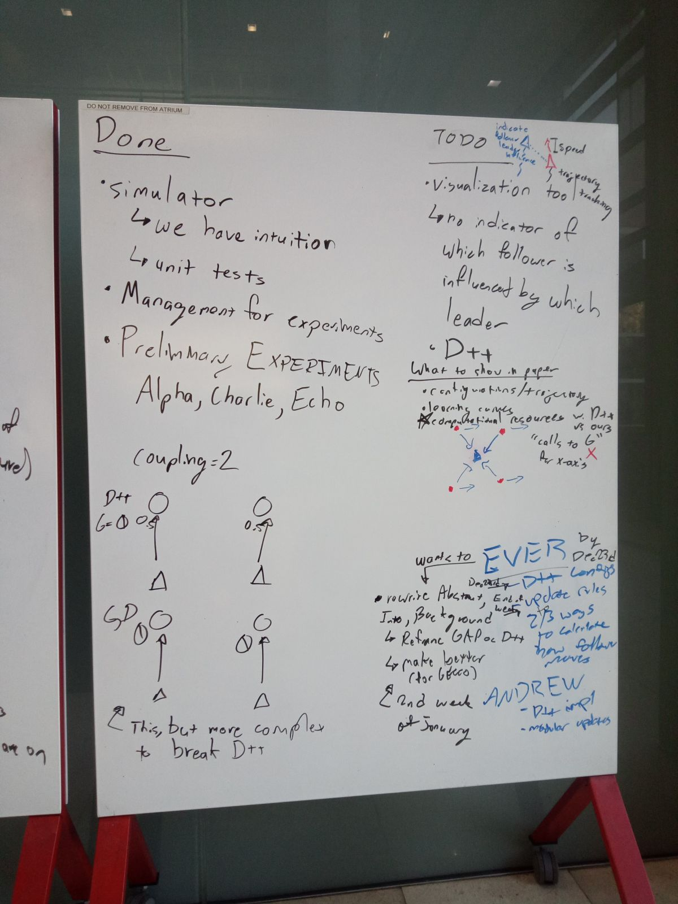
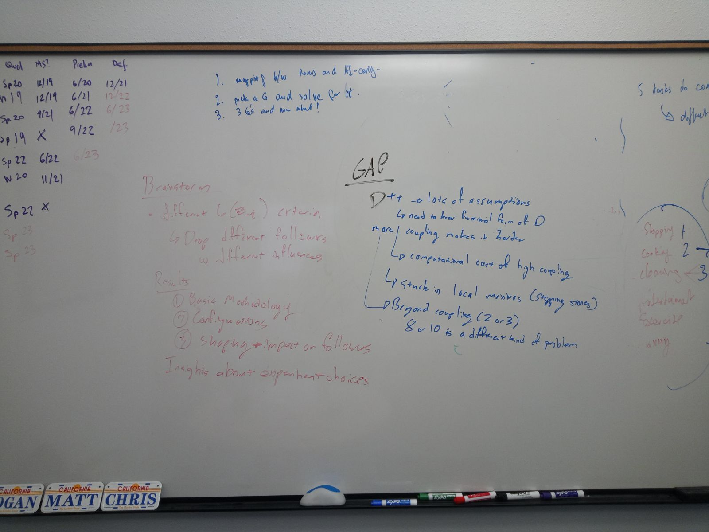
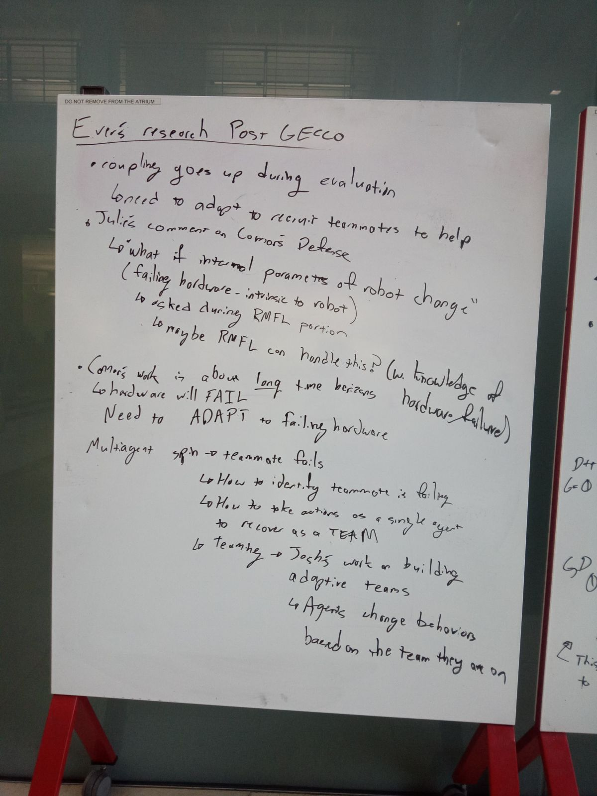

Leader Follower
=====

## Roadmap

Andrew:

-[ ] Fix D++ bug. Push code to github. 
-[ ] Documentation. (Explaining what the parts are and how they work)
-[ ] Create trajectory graph visualization tool (Figure 4 from D++). Include circles around POIs to indicate observation radius. 
-[ ] Re-run ROB538 experiments with xy update rules

Ever:
-[ ] Write up new introduction (and abstract) focusing on the 8 questions. 
-[ ] Decide what the pitch will be. (leader-follower vs reward shaping vs both)
-[ ] More background lit review.

Meetings:
-[ ] Meet to prepare for Tuesday presentation. 11 am Thursday. Recurring meeting. 
-[ ] Sit together and get Ever up to speed on code. (also 11 am Thursday)

## Quick Start

## Installation

## Testing

## Simulator

## Learning
